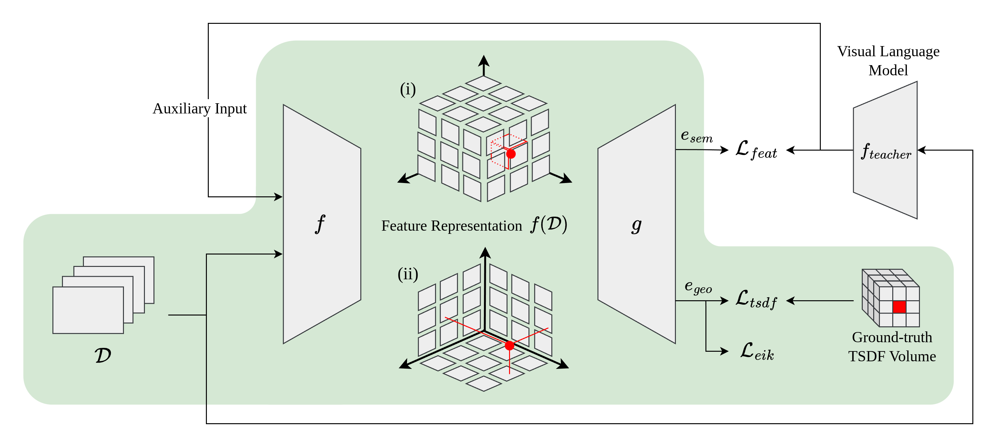
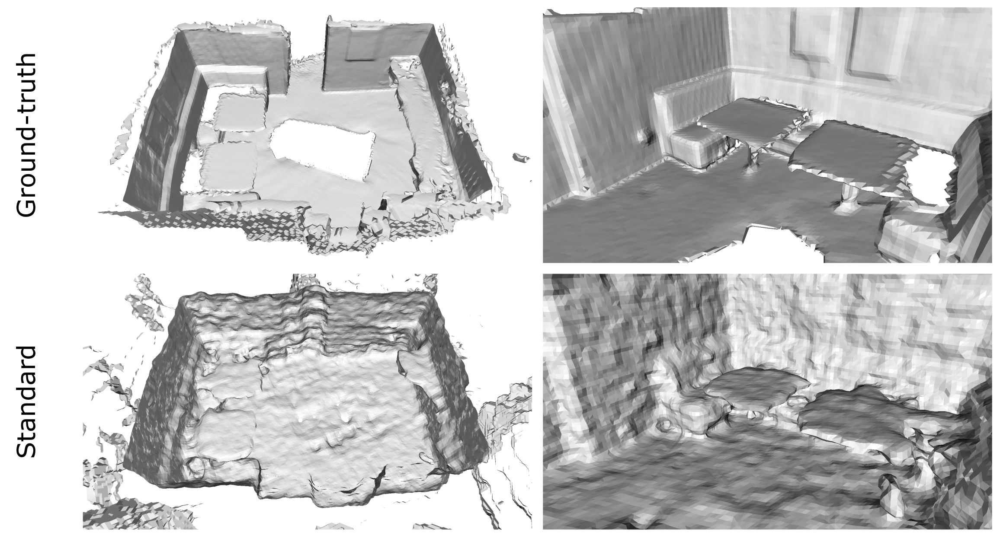

# Generalizable Neural Fields

Learning scene-level generalizable neural fields using NeRFs and feature distillation from pre-trained Vision Language Models, creating a unified scene representation that captures geometric and semantic properties.

## Project

Author: Christian Maurer\
Supervisors: Snehal Jauhri, Sophie Lüth

This repository contains code that was developed in the summer semester 2024 during the practical course "Intelligent Robotic Manipulation Part II" offered by PEARL (Interactive Robot Perception & Learning) at the Computer Science Department of the Technical University of Darmstadt.


## Method
We encode observations $D$, in the form of posed RGB-D frames, using an encoding function $f$, to build a generalizable feature representation $f(D)$. We introduce (i) a volumetric representation and (ii) a multi-planar representation which can be used individually or in combination. A decoder network $g$ is used to obtain a semantic feature $e_{sem}$ and a geometric feature $e_{geo}$ from a query point (marked in red) that can be used for downstream applications like navigation or manipulation. A visual language model serves as a teacher model for language alignment through knowledge distillation. The model is supervised to reconstruct geometry via TSDFs. Using only geometric features, our model is able to reconstruct geometry from a few observations.


<p align="center">
 
    <br> 
    <em>Overview of our method. The area highlighted in green shows what is currently implemented.</em>
</p>


<p align="center">
 
    <br> 
    <em>Scene reconstruction from N=8 depth frames.</em>
</p>

## Installation
Create a conda environment:

```
conda create -n gen-nerf-cuda118 python=3.9
conda activate gen-nerf-cuda118
```
Install necessary packages in the following order:

```
conda install pytorch==2.3.0 torchvision==0.18.0 torchaudio pytorch-cuda=11.8 -c pytorch -c nvidia
pip install torch-scatter -f https://data.pyg.org/whl/torch-2.3.0+cu118.html
pip install lightning
pip install hydra-core --upgrade
pip install rootutils
pip install matplotlib==3.8
pip install scikit-image
pip install trimesh>=3.7.6
pip install opencv-python
pip install open3d>=0.10.0.0
pip install wandb tensorboard
pip install rich pypng pyrender
pip install torch-cluster  # load gcc!
```

Clone this repository and install it as a package:
```
git clone https://github.com/mrchris7/gen-nerf.git
cd gen-nerf
pip install -e .
```

## Data Preparation
We use the [ScanNet](http://www.scan-net.org/) dataset for this work.
The following steps describe how to prepare the data when working on a computational cluster that provides a limit on the number of files on the persistent space however it allows for an unlimited number of files on a temporary node-local space.

First, you need to download the dataset to a directory ```PATH_RAW```, following the instructions from http://www.scan-net.org/. You also need to download the data splits and from https://github.com/ScanNet/ScanNet/tree/master/BenchmarkScripts (Benchmark Scripts).


We extract the data from the ```.sens``` format to a directory ```PATH_DATA```. Note that we archive all frames of a sequence to reduce the number of files:

```
python scripts/read_scannet.py\
 --path_in PATH_RAW\
 --path_out PATH_DATA\
 --export_all\
 --archive_result
```


To obtain ground-truth TSDF values, we temporarily build the whole scannet dataset by extracting all files in a directory `PATH_TEMP` on a node-local space:
```
python scripts/build_scannet.py\
 --path_target PATH_TEMP\
 --path_raw PATH_RAW\
 --path_archive PATH_DATA\
 --extract_archives
```

We generate ground-truth TSDF values using the extracted data in `PATH_TEMP` and store them in directory `PATH_DATA` with:
```
python src/data/prepare/prepare_data.py\
 --path PATH_TEMP\
 --path_meta PATH_DATA
```

After the ground-truth TSDF values are generated, the node-local directory `PATH_TEMP` is no longer needed and can be deleted. 

The final directory structure should look as follows:
```
PATH_DATA
└───scans
|   └───scene0000_00
|   |   └───info.json
|   |   └───color
|   |   │   └───color.tar (0.jpg, 1.jpg, ...)
|   |   └───depth
|   |   │   └───depth.tar (0.png, 1.png, ...)
|   |   └───poses
|   |   │   └───poses.tar (0.txt, 1.txt, ...)
|   |   └───intrinsics
|   |   │   └───extrinsic_color.txt     
|   |   │   └───extrinsic_depth.txt 
|   |   │   └───intrinsic_color.txt
|   |   │   └───intrinsic_depth.txt
|   |   └───mesh_04.ply
|   |   └───...
|   |   └───tsdf_04.npz
|   |   └───...
|   └───...
└───scans_test
    └───scene700_00
    └───...
```

To setup this structure you can modify and run these two job scripts when working on a computing cluster:
```
sbatch job_scripts/read_scannet.sh
sbatch job_scripts/generate_tsdf.sh
```


## Configuration

We use the configuration framework Hydra that allows for structured and hierarchical organization of configuration files (see `configs`). To define a new experiment, create a new file i.e. `new_exp.yaml` inside `configs/experiment` and set the desired parameters.

## Training

Run an experiment by using the configuration file `new_exp.yaml`:
```
python src/train.py experiment=new_exp
```
After training, testing is applied in which the predicted mesh, TSDF volume and other informations are stored in directory ```OUTPUT``` (see `debug_dir` in `configs/paths/default.yaml`).

## Evaluation

Run evaluation using the output prodced and stored in ```OUTPUT```:

```
python src/models/evaluation.py --result OUTPUT
```